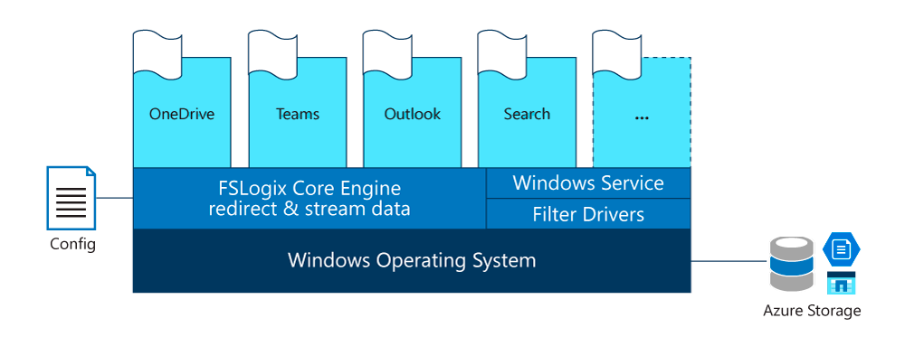
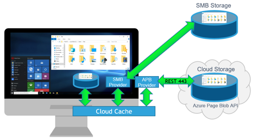
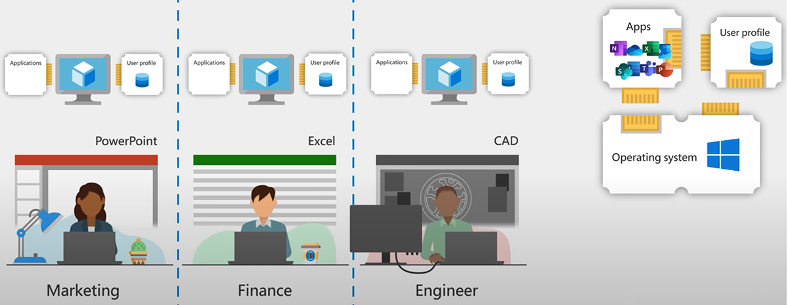
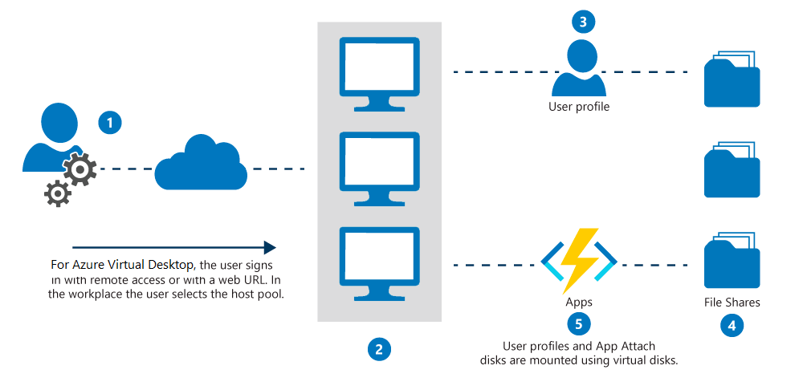
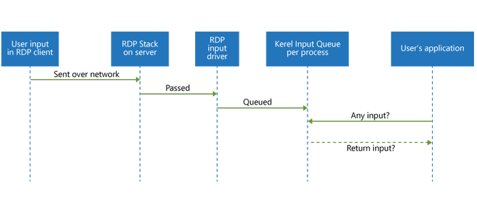
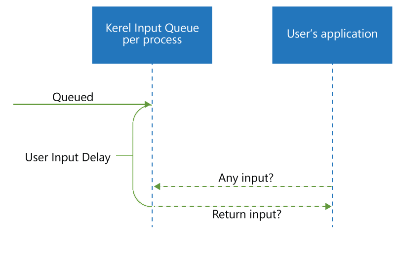
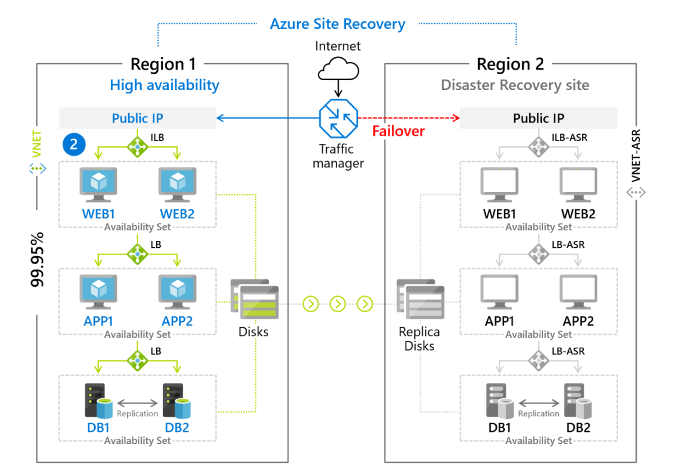

# Azure Virtual Desktop notes (AZ-140)

- [Azure Virtual Desktop notes (AZ-140)](#azure-virtual-desktop-notes-az-140)
	- [To check/do](#to-checkdo)
	- [Authentication](#authentication)
		- [Domain join options](#domain-join-options)
			- [Azure AD-joined](#azure-ad-joined)
				- [Limitations](#limitations)
				- [Assign users to host pools](#assign-users-to-host-pools)
				- [Connection options](#connection-options)
		- [Enabling MFA for Azure AD joined virtual machines](#enabling-mfa-for-azure-ad-joined-virtual-machines)
	- [Configuration](#configuration)
		- [Supported Operating Systems](#supported-operating-systems)
		- [Client operating systems](#client-operating-systems)
		- [Host pools](#host-pools)
			- [Configure host pool assignment type (personal desktop host pools)](#configure-host-pool-assignment-type-personal-desktop-host-pools)
		- [Load balancing](#load-balancing)
		- [Update Management](#update-management)
		- [Limits](#limits)
		- [Default RDP file properties](#default-rdp-file-properties)
		- [Licensing](#licensing)
	- [Compute](#compute)
		- [Virtual Machines](#virtual-machines)
			- [Create virtual machines for the host pool](#create-virtual-machines-for-the-host-pool)
			- [Prepare virtual machines](#prepare-virtual-machines)
			- [Register virtual machines to the AVD host pool](#register-virtual-machines-to-the-avd-host-pool)
		- [Virtual Machine Images](#virtual-machine-images)
		- [General imaging recommendations](#general-imaging-recommendations)
			- [Managed images](#managed-images)
			- [Upload master image to a storage account in Azure](#upload-master-image-to-a-storage-account-in-azure)
			- [Modify session host image](#modify-session-host-image)
			- [Azure Compute Gallery](#azure-compute-gallery)
				- [Azure Compute Gallery Sharing methods](#azure-compute-gallery-sharing-methods)
				- [Azure Computer Gallery limits](#azure-computer-gallery-limits)
			- [Scaling with Azure Compute Gallery](#scaling-with-azure-compute-gallery)
			- [Azure Image Builder](#azure-image-builder)
				- [Recommendations for creating Windows images](#recommendations-for-creating-windows-images)
				- [Install Microsoft 365 Apps on a master Virtual Hard Disk image](#install-microsoft-365-apps-on-a-master-virtual-hard-disk-image)
				- [Windows Language pack installs](#windows-language-pack-installs)
	- [Storage](#storage)
		- [Storage solutions for Azure Virtual Desktop](#storage-solutions-for-azure-virtual-desktop)
		- [Azure Management details](#azure-management-details)
		- [Azure Files tiers](#azure-files-tiers)
		- [Profile Container vs Office Container](#profile-container-vs-office-container)
			- [Using Profile Container and Office Container together](#using-profile-container-and-office-container-together)
		- [FSLogix profile containers](#fslogix-profile-containers)
			- [Configure the storage account for FSLogix profiles](#configure-the-storage-account-for-fslogix-profiles)
			- [Install FSLogix components](#install-fslogix-components)
				- [Microsoft FSLogix Apps Installation](#microsoft-fslogix-apps-installation)
				- [Application Masking Rule Editor Installation](#application-masking-rule-editor-installation)
			- [Configure FSLogix profile containers](#configure-fslogix-profile-containers)
				- [Before configuring Profile Container](#before-configuring-profile-container)
				- [Configure Profile Container Registry settings](#configure-profile-container-registry-settings)
				- [Optional Registry settings](#optional-registry-settings)
				- [Set up Include and Exclude User Groups](#set-up-include-and-exclude-user-groups)
		- [Cloud Cache for Profile Container and Office Container](#cloud-cache-for-profile-container-and-office-container)
		- [Installing Microsoft Office using FSLogix application containers](#installing-microsoft-office-using-fslogix-application-containers)
		- [Azure Files](#azure-files)
			- [Supported authentication scenarios](#supported-authentication-scenarios)
			- [Restrictions](#restrictions)
	- [Networking](#networking)
		- [RDP shortpath](#rdp-shortpath)
		- [QoS](#qos)
			- [Quality of Service implementation checklist](#quality-of-service-implementation-checklist)
	- [Performance](#performance)
		- [Best practices for Azure Virtual Desktop](#best-practices-for-azure-virtual-desktop)
		- [Host sizing](#host-sizing)
		- [Network](#network)
		- [Performance tooling](#performance-tooling)
	- [Security](#security)
		- [Conditional Access](#conditional-access)
			- [Requirements for an Conditional Access Policy requiring MFA when connection to AVD](#requirements-for-an-conditional-access-policy-requiring-mfa-when-connection-to-avd)
			- [Steps for creating the Conditional Access Policy](#steps-for-creating-the-conditional-access-policy)
		- [RBAC for Azure Virtual Desktop](#rbac-for-azure-virtual-desktop)
		- [Microsoft Intune support](#microsoft-intune-support)
		- [Screen capture protection](#screen-capture-protection)
	- [Application delivery](#application-delivery)
		- [MSIX App attach](#msix-app-attach)
			- [How MSIX app attach works](#how-msix-app-attach-works)
			- [Set up a file share for MSIX app attach](#set-up-a-file-share-for-msix-app-attach)
				- [Recommendations and exclusions](#recommendations-and-exclusions)
				- [RBAC and NTFS permissions](#rbac-and-ntfs-permissions)
			- [Upload MSIX image to a (NetApp) file share](#upload-msix-image-to-a-netapp-file-share)
			- [App specific info](#app-specific-info)
				- [MS-Teams with media optimiazation](#ms-teams-with-media-optimiazation)
			- [Publish built-in apps](#publish-built-in-apps)
				- [Publish MS-Edge](#publish-ms-edge)
			- [Troubleshoot application issues for Azure Virtual Desktop](#troubleshoot-application-issues-for-azure-virtual-desktop)
	- [Optimization](#optimization)
		- [Optimization principles](#optimization-principles)
		- [Virtual Desktop Optimization Tool](#virtual-desktop-optimization-tool)
		- [Updates](#updates)
		- [Persistent virtual desktop environments](#persistent-virtual-desktop-environments)
		- [Non-persistent virtual desktop environments](#non-persistent-virtual-desktop-environments)
		- [Universal Print](#universal-print)
		- [Start VM On Connect](#start-vm-on-connect)
			- [Configuration](#configuration-1)
	- [Availability and Disaster Recovery](#availability-and-disaster-recovery)
		- [Virtual Machine replication](#virtual-machine-replication)
		- [FSLogix config](#fslogix-config)
			- [Azure Files](#azure-files-1)
	- [Troubleshooting](#troubleshooting)
		- [Client troubleshooting](#client-troubleshooting)
			- [Remote Desktop client for Windows 10 stops responding or cannot be opened](#remote-desktop-client-for-windows-10-stops-responding-or-cannot-be-opened)
			- [Web client won't open](#web-client-wont-open)
			- [Web client keeps prompting for credentials.](#web-client-keeps-prompting-for-credentials)


## To check/do
- [ ] Configuration limits
- [ ] Azure Files vs NetApp files
- [ ] Authentication and device registration
- [ ] Update strategy
- [ ] MSIX App attach

## Authentication
AD DS: Azure Virtual Desktop VMs must domain-join an AD DS service, and the AD DS must be in sync with Azure AD to associate users between the two services. You can use Azure AD Connect to associate AD DS with Azure AD.

### Domain join options

#### Azure AD-joined

The configurations listed below are supported with Azure AD-joined virtual machines:

- Personal desktops with local user profiles.
- Pooled desktops used as a jump box. In this configuration, users first access the Azure Virtual Desktop VM before connecting to a different PC on the network. Users shouldn't save data on the VM.
- Pooled desktops or apps where users don't need to save data on the VM. For example, for applications that save data online or connect to a remote database.

> Microsoft recommends Azure AD-joined virtual machines for scenarios where users only need access to cloud-based resources or Azure AD-based authentication.

##### Limitations

Access to your on-premises or Active Directory domain-joined resources and should be considered when deciding whether Azure AD-joined virtual machines suits your environment. Microsoft recommends Azure AD-joined virtual machines for scenarios where users only need access to cloud-based resources or Azure AD-based authentication.

- Azure Virtual Desktop (classic) doesn't support Azure AD-joined virtual machines.
- Azure AD-joined virtual machines don't currently support external users.
- Azure AD-joined virtual machines only supports local user profiles at this time.
- Azure AD-joined virtual machines can't access Azure Files file shares for FSLogix or MSIX app attach. You'll need Kerberos authentication to access either of these features.
- The Windows Store client doesn't currently support Azure AD-joined virtual machines.
- Azure Virtual Desktop doesn't currently support single sign-on for Azure AD-joined virtual machines.

##### Assign users to host pools

For Azure AD-joined virtual machines, you'll need to do two things:

- Assign your users the Virtual Machine User Login role so they can sign in to the virtual machines.
- Assign administrators who need local administrative privileges the Virtual Machine Administrator Login role.

##### Connection options

To enable access from Windows devices not joined to Azure AD, add `targetisaadjoined:i:1` as a custom RDP property to the host pool.

To access Azure AD-joined virtual machines using the web, Android, macOS and iOS clients, you must add `targetisaadjoined:i:1` as a custom RDP property to the host pool. These connections are restricted to entering user name and password credentials when signing in to the session host.

### Enabling MFA for Azure AD joined virtual machines

You can enable multifactor authentication for Azure AD-joined virtual machines by setting a Conditional Access policy on the Azure Virtual Desktop app. For connections to succeed, disable the legacy per-user multifactor authentication.

## Configuration

### Supported Operating Systems

Azure Virtual Desktop session hosts: A host pool can run the following operating systems:

	* Windows 7 Enterprise
	* Windows 10 Enterprise
	* Windows 10 Enterprise Multi-session
	* Windows Server 2012 R2 and above
	* Custom Windows system images with pre-loaded apps, group policies, or other customizations

### Client operating systems

Azure Virtual Desktop doesn't support the RemoteApp and Desktop Connections (RADC) client or the Remote Desktop Connection (MSTSC) client.

You can access Azure Virtual Desktop resources on devices with Windows 10, Windows 10 IoT Enterprise, and Windows 7 using the Windows Desktop client. ::windows 11?::
The client doesn't support Window 8 or Windows 8.1.

### Host pools

* Pooled host pool
	* Recommended windows 10 multisession
	* No admin rights / unable to add applications 
	* Load balances users to available session host
	
* Personal host pool
	* Usually admin rights 
	* *Always the same session host exclusive to the user 

To create a host pool, workspace and desktop app group, you could use the following PowerShell code:

```powershell
New-AzWvdHostPool -ResourceGroupName <resourcegroupname> -Name <hostpoolname> -WorkspaceName <workspacename> -HostPoolType <Pooled|Personal> -LoadBalancerType <BreadthFirst|DepthFirst|Persistent> -Location <region> -DesktopAppGroupName <appgroupname>
```

To create a registration token to authorize a session host to joint the host pool

```powershell
New-AzWvdRegistrationInfo -ResourceGroupName <resourcegroupname> -HostPoolName <hostpoolname> -ExpirationTime $((get-date).ToUniversalTime().AddDays(1).ToString('yyyy-MM-ddTHH:mm:ss.fffffffZ'))
```

To add AD users to the default desktop app group for the host pool:

```powershell
New-AzRoleAssignment -SignInName <userupn> -RoleDefinitionName "Desktop Virtualization User" -ResourceName <hostpoolname+"-DAG"> -ResourceGroupName <resourcegroupname> -ResourceType 'Microsoft.DesktopVirtualization/applicationGroups'
```

Or - better - add AD groups to the default app group for the host pool:

```powershell
New-AzRoleAssignment -ObjectId <usergroupobjectid> -RoleDefinitionName "Desktop Virtualization User" -ResourceName <hostpoolname+"-DAG"> -ResourceGroupName <resourcegroupname> -ResourceType 'Microsoft.DesktopVirtualization/applicationGroups'
```

Export the registration token to a variable, to use later to register the VM to the AVD host pool

```powershell
$token = Get-AzWvdRegistrationInfo -ResourceGroupName <resourcegroupname> -HostPoolName <hostpoolname>
```

#### Configure host pool assignment type (personal desktop host pools)

For personal desktop host pools, there are two assignment options:

1. Automatic assignment
2. Direct assignment

For direct assignment there are 3 cmdlets, for automatic only the first two, but with the automatic assignment type of course.

```powershell
Update-AzWvdHostPool -ResourceGroupName <resourcegroupname> -Name <hostpoolname> -PersonalDesktopAssignmentType Direct
```

```powershell
New-AzRoleAssignment -SignInName <userupn> -RoleDefinitionName "Desktop Virtualization User" -ResourceName <appgroupname> -ResourceGroupName <resourcegroupname> -ResourceType 'Microsoft.DesktopVirtualization/applicationGroups'
```

```powershell
Update-AzWvdSessionHost -HostPoolName <hostpoolname> -Name <sessionhostname> -ResourceGroupName <resourcegroupname> -AssignedUser <userupn>
```

### Load balancing

The following load-balancing methods are available in Azure Virtual Desktop:
		
* Breadth-first load balancing allows you to evenly distribute user sessions across the session hosts in a host pool.
* Depth-first load balancing allows you to saturate a session host with user sessions in a host pool. Once the first session reaches its session limit threshold, the load balancer directs any new user connections to the next session host in the host pool until it reaches its limit, and so on.

### Update Management

There are several options for updating Azure Virtual Desktop desktops. Deploying an updated image every month guarantees compliance and state.

	 
	* [Microsoft Endpoint Configuration Manager (MECM)](https://learn.microsoft.com/en-us/mem/configmgr/)  updates server and desktop operating systems.
	* [Windows Updates for Business](https://learn.microsoft.com/en-us/windows/deployment/update/waas-manage-updates-wufb)  updates desktop operating systems like Windows 10 multi-session.
	* [Azure Update Management](https://learn.microsoft.com/en-us/azure/automation/update-management/overview)  updates server operating systems.
	* [Azure Log Analytics](https://learn.microsoft.com/en-us/azure/azure-monitor/platform/log-analytics-agent)  checks compliance.
	* Deploy a new (custom) image to session hosts every month for the latest Windows and applications updates. You can use an image from the Azure Marketplace or a  [custom Azure managed image](https://learn.microsoft.com/en-us/azure/virtual-machines/windows/capture-image-resource) .

### Limits

Limits to take into consideration

* Azure virtual machine session host name prefixes can't exceed 11 characters, due to auto-assigning of instance names and the NetBIOS limit of 15 characters per computer account.
* You can currently deploy 399 VMs per Azure Virtual Desktop Azure Resource Manager template deployment without Availability Sets, or 200 virtual machines per Availability Set. You can increase the number of VMs per deployment by switching off Availability Sets in either the Azure Resource Manager template or the Azure portal host pool enrollment.

### Default RDP file properties

| **RDP properties**         | **Desktops**                                                        | **RemoteApps**                  |
|----------------------------|---------------------------------------------------------------------|---------------------------------|
| Multi-monitor mode         | Enabled                                                             | N/A                             |
| Drive redirections enabled | Drives, clipboard, printers, COM ports, USB devices, and smartcards | Drives, clipboard, and printers |
| Remote audio mode          | Play locally.                                                       | Play locally.                   |

### Licensing

There are a few ways to use the Azure Virtual Desktop license:

- You can create a host pool and its session host virtual machines using the [Azure Marketplace offering](https://learn.microsoft.com/en-us/azure/virtual-desktop/create-host-pools-azure-marketplace). Virtual machines created this way automatically have the license applied.
- You can create a host pool and its session host virtual machines using the [GitHub Azure Resource Manager template](https://learn.microsoft.com/en-us/azure/virtual-desktop/virtual-desktop-fall-2019/create-host-pools-arm-template). Virtual machines created this way automatically have the license applied.
- You can apply a license to an existing session host virtual machine. Follow the instructions in [Create a host pool with PowerShell](https://learn.microsoft.com/en-us/azure/virtual-desktop/create-host-pools-powershell) to create a host pool and associated virtual machines.

## Compute

### Virtual Machines

#### Create virtual machines for the host pool

You can create a VM in multiple ways:

- Create a virtual machine from an Azure Gallery image.
- Create a virtual machine from a managed image.
- Create a virtual machine from an unmanaged image.

#### Prepare virtual machines

Do the following to prepare your virtual machines before you can install the Azure Virtual Desktop agents and register the virtual machines to your Azure Virtual Desktop host pool:

- Domain join the virtual machine. This allows incoming Azure Virtual Desktop users to be mapped from their Azure Active Directory account to their Active Directory account and be successfully allowed access to the virtual machine.
- Install the Remote Desktop Session Host (RDSH) role if the virtual machine is running a Windows Server OS. The RDSH role allows the Azure Virtual Desktop agents to install properly.

#### Register virtual machines to the AVD host pool

To register the Azure Virtual Desktop agents, do the following on each virtual machine:

- Connect to the virtual machine with the credentials you provided when creating the virtual machine.
- Download and install the Azure Virtual Desktop Agent.
- Download the [Azure Virtual Desktop Agent](https://query.prod.cms.rt.microsoft.com/cms/api/am/binary/RWrmXv).
- Run the installer. When the installer asks you for the registration token, enter the value you got from the Get-AzWvdRegistrationInfo cmdlet.
- Download and install the Azure Virtual Desktop Agent Bootloader.
- Download the [Azure Virtual Desktop Agent Bootloader](https://query.prod.cms.rt.microsoft.com/cms/api/am/binary/RWrxrH).
- Run the installer.

### Virtual Machine Images

Windows 11/10 Enterprise multi-session is available in the Azure Image Gallery. There are two options for customizing this image.

- The first option is to provision a virtual machine in Azure (See: Create a virtual machine from a managed image).
- The second option is to create the image locally by downloading the image, provisioning a Hyper-V virtual machine, and customizing it to suit your needs.

### General imaging recommendations

Here are some extra things you should keep in mind when creating a golden image:

- Don't capture a VM that already exists in your host pools. The image will conflict with the existing VM's configuration, and the new VM won't work.
- Make sure to remove the VM from the domain before running sysprep.
- Delete the base VM once you've captured the image from it.
- After you've captured your image, don't use the same VM you captured again. Instead, create a new base VM from the last snapshot you created. You'll need to periodically update and patch this new VM on a regular basis.
- Don't create a new base VM from an existing custom image.

#### Managed images

Before creating a new virtual machine, create a managed virtual machine image to use as the source image and grant read access on the image to any user who should have access to the image.

One managed image supports up to 20 simultaneous deployments. Attempting to create more than 20 virtual machines concurrently, from the same managed image, may result in provisioning timeouts due to the storage performance limitations of a single VHD. To create more than 20 virtual machines concurrently, use a Shared Image Galleries image configured with 1 replica for every 20 concurrent virtual machine deployments.

#### Upload master image to a storage account in Azure

This only applies when the master image was created locally.

The following instructions apply to a master image was created locally that can be loaded into an Azure storage.

1. Convert the VM image (VHD) to Fixed if you haven't already. If you don't convert the image to Fixed, you can't successfully create the image.
2. Upload the VHD to a blob container in your storage account. You can upload quickly with the Storage Explorer tool.
3. Next, go to the Azure portal in your browser and search for "Images." Your search should lead you to the Create image page.

#### Modify session host image

Some steps to take

- Disable automatic updates
- Specify start layout
- Set up time zone redirection
- Disable Storage Sense

#### Azure Compute Gallery

An Azure Compute Gallery is made up of:

- **Gallery** - Container for multiple images. A gallery is deployed in one region.
- **Image definitions** - a conceptual grouping for images.
- **Image versions** - an image type used for deploying a VM or scale set. Image versions can be replicated to other regions where VMs need to be deployed.

##### Azure Compute Gallery Sharing methods

| **Share with:**                                | **Option**                                                                                                                       |
|------------------------------------------------|----------------------------------------------------------------------------------------------------------------------------------|
| Specific people, groups, or service principals | Role-based access control (RBAC) lets you share resources to specific people, groups, or service principals on a granular level. |
| Subscriptions or tenants (Direct Shared)       | Direct shared gallery (preview) lets you share to everyone in a subscription or tenant.                                          |
| Everyone                                       | Community gallery (preview) lets you share your entire gallery publicly, to all Azure users.                                     |

##### Azure Computer Gallery limits

There are limits, per subscription, for deploying resources using Azure Compute Galleries:

- 100 shared image galleries, per subscription, per region.
- 1,000 image definitions, per subscription, per region.
- 10,000 image versions, per subscription, per region.
- 10 image version replicas, per subscription, per region.
- Any disk attached to the image must be less than or equal to 1TB in size.

#### Scaling with Azure Compute Gallery

With Azure Compute Gallery, you can now deploy up to a 1,000 VM instances in a virtual machine scale set (up from 600 with managed images). Image replicas provide for better deployment performance, reliability, and consistency. You can set a different replica count in each target region, based on the scale needs for the region. Since each replica is a deep copy of your image, replicas help scale your deployments linearly with each extra replica. While we understand no two images or regions are the same, here’s our general guideline on how to use replicas in a region:

- For non-Virtual Machine Scale Set deployments - For every 20 VMs that you create concurrently, we recommend you keep one replica. For example, if you're creating 120 VMs concurrently using the same image in a region, we suggest you keep at least 6 replicas of your image.
- For Virtual Machine Scale Set deployments - For every scale set deployment with up to 600 instances, we recommend you keep at least one replica. For example, if you're creating 5 scale sets concurrently, each with 600 VM instances using the same image in a single region, we suggest you keep at least 5 replicas of your image.

We always recommend you to overprovision the number of replicas due to factors like image size, content, and OS type.


#### Azure Image Builder

Azure Image Builder uses a Bicep file or an ARM JSON template file to pass information into the Image Builder service. For latest API versions, see template reference. To see examples of full .json files, see the [Azure Image Builder GitHub](https://github.com/Azure/azvmimagebuilder/tree/main/quickquickstarts).

An example of the Bicep template for Image builder:

```powershell
resource azureImageBuilder 'Microsoft.VirtualMachineImages/imageTemplates@2022-02-14' = {
  name: azureImageBuilderName
  location: '<region>'
  tags:{
    <name>: '<value>'
    <name>: '<value>'
  }
  identity:{}
  properties:{
    buildTimeoutInMinutes: <minutes>
    customize: []
    distribute: []
    source: {}
    stagingResourceGroup: '/subscriptions/<subscriptionID>/resourceGroups/<stagingResourceGroupName>'
    validate: {}
    vmProfile:{
      vmSize: '<vmSize>'
      proxyVmSize: '<vmSize>'
      osDiskSizeGB: <sizeInGB>
      vnetConfig: {
        subnetId: '/subscriptions/<subscriptionID>/resourceGroups/<vnetRgName>/providers/Microsoft.Network/virtualNetworks/<vnetName>/subnets/<subnetName>'
      }
      userAssignedIdentities: [
        '/subscriptions/<subscriptionID>/resourceGroups/<identityRgName>/providers/Microsoft.ManagedIdentity/userAssignedIdentities/<identityName1>'
        '/subscriptions/<subscriptionID>/resourceGroups/<identityRgName>/providers/Microsoft.ManagedIdentity/userAssignedIdentities/<identityName2>'
        '/subscriptions/<subscriptionID>/resourceGroups/<identityRgName>/providers/Microsoft.ManagedIdentity/userAssignedIdentities/<identityName3>'
        ...
      ]
    }
  }
}
```

For Image Builder to have permissions to read/write images, and read in scripts from Azure Storage, you must create an Azure user-assigned identity that has permissions to the individual resources.

Some things that are good to know:

- Default build timeout is 240 minutes (4 hrs)
- When using customize:
  - You can use multiple customizers.
  - Customizers execute in the order specified in the template.
  - If one customizer fails, then the whole customization component will fail and report back an error.
  - Test the scripts thoroughly before using them in a template. Debugging the scripts by themselves is easier.
  - Don't put sensitive data in the scripts. Inline commands can be viewed in the image template definition. If you have sensitive information (including passwords, SAS token, authentication tokens, etc.), it should be moved into scripts in Azure Storage, where access requires authentication.
  - The script locations need to be publicly accessible, unless you're using MSI.

Examples of IMAGE builder customization settings can be found here: [Create an Azure Image Builder Bicep or ARM JSON template | MS-Learn](https://learn.microsoft.com/en-us/azure/virtual-machines/linux/image-builder-json?tabs=bicep%2Cazure-powershell)

Azure Image Builder supports three distribution targets:

- managedImage - managed image.
- sharedImage - Azure Compute Gallery.
- VHD - VHD in a storage account.

##### Recommendations for creating Windows images

- **VM size**: For Windows, use Standard_D2_v2 or greater. The default size is Standard_D1_v2, which isn't suitable for Windows.
- **Comment your code**: The VM Image Builder log, customization.log, is verbose. If you comment your scripts by using 'write-host', they'll be sent to the logs, which should make troubleshooting easier.
- **Exit codes**: VM Image Builder expects all scripts to return a 0 exit code. If you use a non-zero exit code, VM Image Builder fails the customization and stops the build. If you have complex scripts, add instrumentation and emit exit codes, which will be shown in the customization.log file.
- Test and retest your code on a standalone VM. Ensure that there are no user prompts, that you're using the correct privileges, and so on.
- Networking: Set-NetAdapterAdvancedProperty is set in the optimization script but fails the VM Image Builder build. Because it disconnects the network, it's commented out.

##### Install Microsoft 365 Apps on a master Virtual Hard Disk image

To activate shared computer activation using GPO: `Computer Configuration\Policies\Administrative Templates\Microsoft Office 2016 (Machine)\Licensing`

Sample configuration xml-file:

```xml
<Configuration>
<Add OfficeClientEdition="64" Channel="MonthlyEnterprise">
<Product ID="O365ProPlusRetail">
<Language ID="en-US" />
<Language ID="MatchOS" />
<ExcludeApp ID="Groove" />
<ExcludeApp ID="Lync" />
<ExcludeApp ID="OneDrive" />
<ExcludeApp ID="Teams" />
</Product>
</Add>
<RemoveMSI/>
<Updates Enabled="FALSE"/>
<Display Level="None" AcceptEULA="TRUE" />
<Logging Level="Standard" Path="%temp%\WVDOfficeInstall" />
<Property Name="FORCEAPPSHUTDOWN" Value="TRUE"/>
<Property Name="SharedComputerLicensing" Value="1"/>
</Configuration>
```

Change Office default behaviour:

```shell
rem Mount the default user registry hive
reg load HKU\TempDefault C:\Users\Default\NTUSER.DAT
rem Must be executed with default registry hive mounted.
reg add HKU\TempDefault\SOFTWARE\Policies\Microsoft\office\16.0\common /v InsiderSlabBehavior /t REG_DWORD /d 2 /f
rem Set Outlooks Cached Exchange Mode behavior
rem Must be executed with default registry hive mounted.
reg add "HKU\TempDefault\software\policies\microsoft\office\16.0\outlook\cached mode" /v enable /t REG_DWORD /d 1 /f
reg add "HKU\TempDefault\software\policies\microsoft\office\16.0\outlook\cached mode" /v syncwindowsetting /t REG_DWORD /d 1 /f
reg add "HKU\TempDefault\software\policies\microsoft\office\16.0\outlook\cached mode" /v CalendarSyncWindowSetting /t REG_DWORD /d 1 /f
reg add "HKU\TempDefault\software\policies\microsoft\office\16.0\outlook\cached mode" /v CalendarSyncWindowSettingMonths  /t REG_DWORD /d 1 /f
rem Unmount the default user registry hive
reg unload HKU\TempDefault

rem Set the Office Update UI behavior.
reg add HKLM\SOFTWARE\Policies\Microsoft\office\16.0\common\officeupdate /v hideupdatenotifications /t REG_DWORD /d 1 /f
reg add HKLM\SOFTWARE\Policies\Microsoft\office\16.0\common\officeupdate /v hideenabledisableupdates /t REG_DWORD /d 1 /f
```

Install OneDrive in per-machine mode

```shell
# If you installed Office with OneDrive by omitting <ExcludeApp ID="OneDrive" /, uninstall any existing OneDrive per-user installations from an elevated command prompt by running the following command:

"[staged location]\OneDriveSetup.exe" /uninstall

# Run this command from an elevated command prompt to set the AllUsersInstall registry value:

REG ADD "HKLM\Software\Microsoft\OneDrive" /v "AllUsersInstall" /t REG_DWORD /d 1 /reg:64

# Run this command to install OneDrive in per-machine mode:

Run "[staged location]\OneDriveSetup.exe" /allusers

# Run this command to configure OneDrive to start at sign in for all users:

REG ADD "HKLM\Software\Microsoft\Windows\CurrentVersion\Run" /v OneDrive /t REG_SZ /d "C:\Program Files (x86)\Microsoft OneDrive\OneDrive.exe /background" /f

# Enable Silently configure user account by running the following command.

REG ADD "HKLM\SOFTWARE\Policies\Microsoft\OneDrive" /v "SilentAccountConfig" /t REG_DWORD /d 1 /f

# Redirect and move Windows known folders to OneDrive by running the following command.

REG ADD "HKLM\SOFTWARE\Policies\Microsoft\OneDrive" /v "KFMSilentOptIn" /t REG_SZ /d "<your-AzureAdTenantId>" /f
```

##### Windows Language pack installs

After installing the language pack in the image and deploying the VM, you will need a logon script for each user that signs in:

Below is an example of such a script.

```powershell
$LanguageList = Get-WinUserLanguageList
$LanguageList.Add("es-es")
$LanguageList.Add("fr-fr")
$LanguageList.Add("zh-cn")
Set-WinUserLanguageList $LanguageList -force
```

## Storage
Azure files recommended for most customers. Other options are Azure NetApp files and Storage Spaces Direct.

See https://learn.microsoft.com/en-us/training/modules/design-user-identities-profiles/4-recommend-appropriate-storage-solution

### Storage solutions for Azure Virtual Desktop

| **Features**            | **Azure Files**                                                                                                     | **Azure NetApp Files**                                                | **Storage Spaces Direct**                                                                                                             |
|-------------------------|---------------------------------------------------------------------------------------------------------------------|-----------------------------------------------------------------------|---------------------------------------------------------------------------------------------------------------------------------------|
| Use case                | General purpose                                                                                                     | Ultra performance or migration from NetApp on-premises                | Cross-platform                                                                                                                        |
| Platform service        | Yes, Azure-native solution                                                                                          | Yes, Azure-native solution                                            | No, self-managed                                                                                                                      |
| Regional availability   | All regions                                                                                                         | Select regions                                                        | All regions                                                                                                                           |
| Redundancy              | Locally redundant/zone-redundant/geo-redundant/geo-zone-redundant                                                   | Locally redundant                                                     | Locally redundant/zone-redundant/geo-redundant                                                                                        |
| Tiers and performance   | Standard (Transaction optimized) Premium Up to max 100K IOPS per share with 10 GBps per share at about 3 ms latency | Standard Premium Ultra Up to 4.5GBps per volume at about 1 ms latency | Standard HDD: up to 500 IOPS per-disk limits, Standard SSD: up to 4k IOPS per-disk limits Premium SSD: up to 20k IOPS per-disk limits |
| Capacity                | 100 TiB per share, Up to 5 PiB per general purpose account                                                          | 100 TiB per volume, up to 12.5 PiB per subscription                   | Maximum 32 TiB per disk                                                                                                               |
| Required infrastructure | Minimum share size 1 GiB                                                                                            | Minimum capacity pool 4 TiB, min volume size 100 GiB                  | Two VMs on Azure IaaS or at least three VMs without and costs for disks                                                               |
| Protocols               | SMB 3.0/2.1, NFSv4.1 (preview), REST                                                                                | NFSv3, NFSv4.1 (preview), SMB 3.x/2.x                                 | NFSv3, NFSv4.1, SMB 3.1                                                                                                               |

### Azure Management details

| **Features**                       | **Azure Files**                                                    | **Azure NetApp Files**                                             | **Storage Spaces Direct**                                                      |
|------------------------------------|--------------------------------------------------------------------|--------------------------------------------------------------------|--------------------------------------------------------------------------------|
| Access                             | Cloud, on-premises and hybrid (Azure file sync)                    | Cloud, on-premises (via ExpressRoute)                              | Cloud, on-premises                                                             |
| Backup                             | Azure backup snapshot integration                                  | Azure NetApp Files snapshots                                       | Azure backup snapshot integration                                              |
| Security and compliance            | All Azure supported certificates                                   | ISO completed                                                      | All Azure supported certificates                                               |
| Azure Active Directory integration | Native Active Directory and Azure Active Directory Domain Services | Azure Active Directory Domain Services and Native Active Directory | Native Active Directory or Azure Active Directory Domain Services support only |

### Azure Files tiers

| **Workload type**            | **Recommended file tier**                                 |
|------------------------------|-----------------------------------------------------------|
| Light (fewer than 200 users) | Standard file shares                                      |
| Light (more than 200 users)  | Premium file shares or standard with multiple file shares |
| Medium                       | Premium file shares                                       |
| Heavy                        | Premium file shares                                       |
| Power                        | Premium file shares                                       |

### Profile Container vs Office Container

Office Container is a subset of Profile Container. As opposed to Profile Container, Office Container redirects only the local user files for Microsoft Office.

All benefits of Office Container are automatic when using Profile Container. There's no need to implement Office Container if Profile Container is your primary solution for managing profiles. Office Container could optionally be used with Profile Container, to place Office Data in a location separate from the rest of the user's profile.

Some things to know about Office Profile Containers:

- Configuration settings for Profile Container are set in `HKLM\SOFTWARE\Policies\FSLogix\ODFC`.
- By default Everyone is added to the `FSLogix ODFC Include List` group.
- Adding a user to the `FSLogix ODFC Exclude` List group means that the FSLogix agent won't attach a FSLogix office container for the user. In the case where a user is a member of both the exclude and include groups, exclude takes priority.

#### Using Profile Container and Office Container together
There are several reasons why Profile Container and Office Container may be used together. The most common reasons are:

- Discretion is wanted in the storage location for Office Data vs. other profile data.
- If the Office Container or Profile Container is damaged, the remaining data remains intact. Storage discretion is useful if there is a problem with Office Data, which can be recovered from the server as the Office Container can be deleted without impacting the rest of the user configuration.
- Office Container may be used with Profile Container as a mechanism to specify which Office components will have their data included in the container.

### FSLogix profile containers

FSLogix addresses many profile container challenges. Key among them are:

- **Performance:** The FSLogix profile containers are high performance and resolve performance issues that have historically blocked cached exchange mode.
- **OneDrive:** Without FSLogix profile containers, OneDrive for Business is not supported in non-persistent RDSH or VDI environments.
- **Additional folders:** FSLogix provides the ability to extend user profiles to include additional folders.



Microsoft has started replacing existing user profile solutions, like UPD, with FSLogix profile containers.

#### Configure the storage account for FSLogix profiles

Two choices for storage account type: 

- **General purpose version 2 (GPv2) storage accounts:** GPv2 storage accounts allow you to deploy Azure file shares on standard/hard disk-based (HDD-based) hardware. GPv2 storage accounts can store other storage resources such as blob containers, queues, or tables. File shares can be deployed into the transaction optimized (default), hot, or cool tiers.
  - Quota can be set, but you pay only for what you use.
- **FileStorage storage accounts:** FileStorage storage accounts allow you to deploy Azure file shares on premium/solid-state disk-based (SSD-based) hardware. FileStorage accounts store Azure file shares. Storage resources, such as blob containers or queues, cannot be deployed in a FileStorage account.
  - Quota is overloaded to mean provisioned size. The provisioned size is the amount that you will be billed. So you need to calculate future growth and required iOPS in advance.

#### Install FSLogix components

The download for  FSLogix includes three installers that are used to install the specific component(s) necessary for your use.

##### Microsoft FSLogix Apps Installation

Microsoft FSLogix Apps installs the core drivers and components for all FSLogix solutions. Any environment using FSLogix must install FSLogix Apps. After installation configure Profile Container before using for profile redirection.

##### Application Masking Rule Editor Installation

Application Masking manages access to Applications, Fonts, and other items based on criteria. The Application Rules Editor is used to Describe the item, such as application, to be managed. The Editor is also used to define criteria rules are managed by.

Things you can do with the Apps Rules Editor:

- Create new Rule Sets.
- Edit existing Rule Sets.
- Manage the user and group assignments for Rule Sets.
- Temporarily test rule-sets.

By default, Rules and Rule Sets are accessed from C:\Program Files\FSLogix\Apps\Rules.

File types:
- rule files (.fxr) 
- assignment files (.fxa)

FSlogix supports four rule types:

- **Hiding Rule** - hides the specified items using specified criteria.
- **Redirect Rule** - causes the specified item to be redirected as defined.
- **App Container Rule** - redirects the specified content into a VHD.
- **Specify Value Rule** - assigns a value for the specified item.

The Application Masking Rule Editor is used to define rules used by [Application Masking](https://learn.microsoft.com/en-us/fslogix/implement-application-masking-tutorial).

#### Configure FSLogix profile containers

- Create a new virtual machine that will act as a file share
  - Join VM to AD DS
- Create an AD group to host the Virtual Desktop Users
  - Share a new folder on C-drive and add the group created to with Full Control permissions
  - Make a note of the UNC path of the Shared Folder
- Download and install the FSLogix software
  - Configure the registry to enable the profiles:
    - `Computer\HKEY_LOCAL_MACHINE\software\FSLogix`
    - Create a key named `Profiles` and set the following values:
      - `Enabled` = `1`
      - `VHDLocations` = `<network path to file share>`

##### Before configuring Profile Container

- Download and install FSLogix Software.
- Consider the storage and network requirements for your users' profiles.
- Verify that your users have appropriate storage permissions where profiles will be placed.
- Profile Container is installed and configured after stopping use of other solutions used to manage remote profiles.
- Exclude the VHD(X) files for Profile Containers from Anti Virus (AV) scanning.

##### Configure Profile Container Registry settings
The configuration of Profile Container is accomplished through registry settings and user groups. Registry settings may be managed manually, with GPOs, or using alternate preferred methods. Configuration settings for Profile Container are set in HKLM\SOFTWARE\FSLogix\Profiles.

Below are settings required to enable Profile Container and to specify the location for the profile VHD to be stored. The minimum required settings to enable Profile Containers are:

| **Value**                       | **Type**           | **Configured Value** | **Description**                                                                                                                                                                                                                                                                                                  |
|---------------------------------|--------------------|----------------------|------------------------------------------------------------------------------------------------------------------------------------------------------------------------------------------------------------------------------------------------------------------------------------------------------------------|
| Enabled (required setting)      | DWORD              | 1                    | 0: Profile Containers disabled. 1: Profile Containers enabled                                                                                                                                                                                                                                                    |
| VHDLocations (required setting) | MULTI_SZ or REG_SZ |                      | A list of file system locations to search for the user's profile VHD(X) file. If one isn't found, one will be created in the first listed location. If the VHD path doesn't exist, it will be created before it checks if a VHD(X) exists in the path. These values can contain variables that will be resolved. |

VHDLocations may be replaced by CCDLocations when using Cloud Cache.

##### Optional Registry settings

| **Value**                            | **Type** | **Configured Value** | **Description**                                                                                                                                                                                                                                                                                                                                                 |
|--------------------------------------|----------|----------------------|-----------------------------------------------------------------------------------------------------------------------------------------------------------------------------------------------------------------------------------------------------------------------------------------------------------------------------------------------------------------|
| DeleteLocalProfileWhenVHDShouldApply | DWORD    | 0                    | 0: no deletion. 1: delete local profile if exists and matches the profile being loaded from VHD. Use caution with this setting. When the FSLogix Profiles system determines a user should have a FSLogix profile, but a local profile exists, Profile Container permanently deletes the local profile. The user will then be signed in with an FSLogix profile. |
| FlipFlopProfileDirectoryName         | DWORD    | 0                    | When set to '1' the SID folder is created as "%username%%sid%" instead of the default "%sid%%username%". This setting has the same effect as setting SIDDirNamePattern = "%username%%sid%" and SIDDirNameMatch = "%username%%sid%".                                                                                                                             |
| PreventLoginWithFailure              | DWORD    | 0                    | If set to 1 Profile Container will load FRXShell if there's a failure attaching to, or using an existing profile VHD(X). The user will receive the FRXShell prompt - default prompt to call support, and the users only option will be to sign out.                                                                                                             |
| PreventLoginWithTempProfile          | DWORD    | 0                    | If set to 1 Profile Container will load FRXShell if it's determined a temp profile has been created. The user will receive the FRXShell prompt - default prompt to call support, and the users only option will be to sign out.                                                                                                                                 |

##### Set up Include and Exclude User Groups
There are often users, such as local administrators, that have profiles that should remain local. During installation, four user groups are created to manage users who's profiles are included and excluded from Profile Container and Office Container redirection.

- By default Everyone is added to the `FSLogix Profile Include` List group.
- Adding a user to the `FSLogix Profile Exclude List` group means that the FSLogix agent will not attach a FSLogix profile container for the user. In the case where a user is a member of both the exclude and include groups, exclude takes priority.

### Cloud Cache for Profile Container and Office Container

Cloud Cache is a technology that provides incremental functionality to Profile Container and Office Container.

Cloud Cache uses a Local Profile to service all reads from a redirected Profile or Office Container, after the first read. Cloud Cache also allows the use of multiple remote locations, which are all continually updated during the user session. Using Cloud Cache can insulate users from short-term loss of connectivity to remote profile containers. Cloud Cache can also provide real time, 'active active' redundancy for Profile Container and Office Container.



It's important to understand that, even with Cloud Cache, all initial reads are accomplished from the redirected location. Likewise, all writes occur to all remote storage locations, although writes go to the Local Cache file first.

Cloud Cache doesn't improve the users' sign-on and sign out experience when using poor performing storage. It's common for environments using Cloud Cache to have slightly slower sign-on and sign out times, relative to using traditional VHDLocations, using the same storage. After initial sign-on, Cloud Cache can improve the user experience for subsequent reads of data from the Profile Container or Office Container, as these reads are serviced from the Local Cache file.

It's possible to move current Profile Container and Office Container implementations to Cloud Cache. To start using Cloud Cache, replace the VHDLocations setting with CCDLocations. CCDLocations and VHDLocations may not be used in the same implementation.

For detailed configuration instructions, refer to [Configure Cloud Cache | Microsoft Learn](https://learn.microsoft.com/en-us/training/modules/implement-manage-fslogix/9-configure-cloud-cache)

### Installing Microsoft Office using FSLogix application containers

You can install Microsoft Office quickly and efficiently by using an FSLogix application container as a template for the other virtual machines (VMs) in your host pool.

Here's why using an FSLogix app container can help make installation faster:

- Offloading your Office apps to an app container reduces the requirements for your C drive size.
- Snapshots or backups of your VM takes less resources.
- Having an automated pipeline through updating a single image makes updating your VMs easier.
- You only need one image to install Office (and other apps) onto all the VMs in your Azure Virtual Desktop deployment.

### Azure Files

#### Supported authentication scenarios

Azure Files supports identity-based authentication for Windows file shares over SMB through the following three methods. You can only use one method per storage account.

- **On-premises AD DS authentication:** On-premises AD DS-joined or Azure AD DS-joined Windows machines can access Azure file shares with on-premises Active Directory credentials that are synched to Azure AD over SMB. Your client must have line of sight to your AD DS. If you already have AD DS set up on-premises or on a VM in Azure where your devices are domain-joined to your AD, you should use AD DS for Azure file shares authentication.
- **Azure AD DS authentication:** Cloud-based, Azure AD DS-joined Windows VMs can access Azure file shares with Azure AD credentials. In this solution, Azure AD runs a traditional Windows Server AD domain on behalf of the customer, which is a child of the customer’s Azure AD tenant.
- **Azure AD Kerberos for hybrid identities:** Using Azure AD for authenticating hybrid user identities allows Azure AD users to access Azure file shares using Kerberos authentication. This means your end users can access Azure file shares over the internet without requiring a line-of-sight to domain controllers from hybrid Azure AD-joined and Azure AD-joined VMs. Cloud-only identities aren't currently supported.

#### Restrictions

- None of the authentication methods support assigning share-level permissions to computer accounts (machine accounts) using Azure RBAC, because computer accounts can't be synced to an identity in Azure AD. If you want to allow a computer account to access Azure file shares using identity-based authentication, use a default share-level permission or consider using a service logon account instead.
- Neither on-premises AD DS authentication nor Azure AD DS authentication is supported against Azure AD-joined devices or Azure AD-registered devices.
- Identity-based authentication isn't supported with Network File System (NFS) shares.

## Networking

### RDP shortpath

Remote Desktop Protocol (RDP) Shortpath for managed networks is a feature of Azure Virtual Desktop that establishes a direct UDP-based transport between Remote Desktop Client and Session host. RDP uses this transport to deliver Remote Desktop and RemoteApp while offering better reliability and consistent latency.

The Azure Virtual Desktop client needs a direct line of sight to the session host. You can get a direct line of sight by using one of these methods:
	
* Make sure the remote client machines are running Windows 11, Windows 10, or Windows 7 and have the  [Windows Desktop client](https://learn.microsoft.com/en-us/windows-server/remote/remote-desktop-services/clients/windowsdesktop)  installed. Currently, non-Windows clients aren't supported.
* Use  [ExpressRoute private peering](https://learn.microsoft.com/en-us/azure/expressroute/expressroute-circuit-peerings) .
* Use a  [Site-to-Site virtual private network (VPN) (IPsec-based)](https://learn.microsoft.com/en-us/azure/vpn-gateway/tutorial-site-to-site-portal) 
* Use a  [Point-to-Site VPN (IPsec-based)](https://learn.microsoft.com/en-us/azure/vpn-gateway/vpn-gateway-howto-point-to-site-resource-manager-portal) 
* Use a  [public IP address assignment](https://learn.microsoft.com/en-us/azure/virtual-network/ip-services/virtual-network-public-ip-address) .

To enable RDP Shortpath for managed networks, you need to enable the RDP Shortpath listener on the session host. You can enable RDP Shortpath on any number of session hosts used in your environment. However, there's no requirement to enable RDP Shortpath on all hosts in your host pool.

This can be done like this:

1. Install administrative templates that add rules and settings for Azure Virtual Desktop. Download the  [Azure Virtual Desktop policy templates file](https://aka.ms/avdgpo)  (AVDGPTemplate.cab) and extract the contents of the .cab file and .zip archive.
2. Copy the terminalserver-avd.admx file, then paste it into the %windir%\PolicyDefinitions folder.
3. Copy the en-us\terminalserver-avd.admlfile, then paste it into the%windir%\PolicyDefinitions\en-us folder.
4. To confirm the files copied correctly, open the Group Policy Editor and go to Computer Configuration, select Administrative Templates, select Windows Components, select Remote Desktop Services, select Remote Desktop Session Host, and select Azure Virtual Desktop.
5. You should see one or more Azure Virtual Desktop policies.
6. Open the Enable RDP Shortpath for managed networks policy and set it to Enabled. If you enable this policy setting, you can also configure the port number that the Azure Virtual Desktop session host will use to listen for incoming connections. The default port is 3390.
7. Restart your session host to apply the changes.

To allow inbound network traffic for RDP Shortpath, use the Microsoft Defender Firewall with Advanced Security node in the Group Policy Management MMC snap-in to create firewall rules

### QoS

#### Quality of Service implementation checklist
At a high level, do the steps listed to implement QoS:

1. Make sure your network is ready.
2. Make sure that RDP Shortpath for managed networks is enabled - QoS policies aren't supported for reverse connect transport.
3. Implement insertion of DSCP markers on session hosts.

As you prepare to implement QoS, keep the guidelines listed below in mind:

* The shortest path to session host is best.
* Any obstacles in between, such as proxies or packet inspection devices, aren't recommended.

Insert DSCP markers
You can compare DSCP markings to postage stamps that indicate to postal workers how urgent the delivery is and how best to sort it for speedy delivery. Once you've configured your network to give priority to RDP streams, lost packets and late packets should diminish significantly.

We recommend using DSCP value 46 that maps to Expedited Forwarding (EF) DSCP class.


## Performance

### Best practices for Azure Virtual Desktop

To ensure your Azure Virtual Desktop environment follows best practices:

- Azure Files storage account must be in the same region as the session host VMs.
- Azure Files permissions should match permissions described in Requirements - Profile Containers.
- Each host pool VM must be built of the same type and size VM based on the same master image.
- Each host pool VM must be in the same resource group to aid management, scaling and updating.
- For optimal performance, the storage solution and the FSLogix profile container should be in the same data center location.
- The storage account containing the master image must be in the same region and subscription where the VMs are being provisioned.

### Host sizing

https://learn.microsoft.com/en-us/windows-server/remote/remote-desktop-services/virtual-machine-recs

### Network

Recommended bandwidth

* Light
	* 1.5 Mbps
* Medium
	* 3 Mbps
* Heavy
	5 Mbps
* Power
	15 Mbps

Display resolution vs bandwidth 

Typical display resolutions at 30 fps
Recommended bandwidth

* About 1024 × 768 px
	* 1.5 Mbps
* About 1280 × 720 px
	3 Mbps
* About 1920 × 1080 px
	* 5 Mbps
* About 3840 × 2160 px (4K)
	* 15 Mbps

### Performance tooling

Use the  [Azure Virtual Desktop Experience Estimator](https://azure.microsoft.com/services/virtual-desktop/assessment/)  to determine the connection round-trip time (RTT) from your current location, through the Azure Virtual Desktop service, to the Azure region where you deploy virtual machines.

## Security

### Conditional Access


#### Requirements for an Conditional Access Policy requiring MFA when connection to AVD

- Assign users a license that includes Azure Active Directory Premium P1 or P2.
- An Azure Active Directory group with your users assigned as group members.
- Enable multifactor authentication for all your users.

#### Steps for creating the Conditional Access Policy

1. Sign in to the Azure portal as a global administrator, security administrator, or Conditional Access administrator.
2. Browse to Azure Active Directory > Security > Conditional Access.
3. Select New policy.
4. Give your policy a name. We recommend that organizations create a meaningful standard for the names of their policies.
5. Under Assignments, select Users and groups.
6. Under Include, select Select users and groups > Users and groups > Choose the group you created.
7. Select Done.
8. Under Cloud apps or actions > Include, select Select apps.
9. Select one of the following apps based on which version of Azure Virtual Desktop you're using. Choose Azure Virtual Desktop (App ID 9cdead84-a844-4324-93f2-b2e6bb768d07)
10. Go to Conditions > Client apps, then select where you want to apply the policy to:

- Select Browser if you want the policy to apply to the web client.
- Select Mobile apps and desktop clients if you want to apply the policy to other clients.
- Select both check boxes if you want to apply the policy to all clients.

11. Once you've selected your app, choose Select, and then select Done.
12. Under Access controls > Grant, select Grant access, Require multifactor authentication, and then Select.
13. Under Access controls > Session, select Sign-in frequency, set the value to the time you want between prompts, and then select Select. For example, setting the value to 1 and the unit to Hours, will require multifactor authentication if a connection is launched an hour after the last one.
14. Confirm your settings and set Enable policy to On.
15. Select Create to enable your policy.

### RBAC for Azure Virtual Desktop

Below are the Azure Virtual Desktop Roles:

- **Desktop Virtualization Contributor role**: Lets you manage all aspects of the deployment. However, it doesn't grant you access to compute resources. You'll also need the User Access Administrator role to publish app groups to users or user groups.
- **Desktop Virtualization Reader role**: Lets you view everything in the deployment but doesn't let you make any changes.
- **The Host Pool Contributor role**: Allows you to manage all aspects of host pools, including access to resources. You'll need an extra contributor role, Virtual Machine Contributor, to create virtual machines. You will need AppGroup and Workspace contributor roles to create host pool using the portal or you can use Desktop Virtualization Contributor role.
- **Host Pool Reader role**: Allows you to view everything in the host pool, but won't allow you to make any changes.
- **Application Group Contributor role**: Lets you manage all aspects of app groups. If you want to publish app groups to users or user groups, you'll need the User Access Administrator role.
- **Application Group Reader role**: Allows you to view everything in the app group and will not allow you to make any changes.
- **Workspace Contributor role**: Allows you to manage all aspects of workspaces. To get information on applications added to the app groups, you'll also need to be assigned the Application Group Reader role.
- **Workspace Reader role**: Lets you view everything in the workspace, but won't allow you to make any changes.
- **User Session Operator role**: Allows you to send messages, disconnect sessions, and use the "logoff" function to sign sessions out of the session host. However, this role doesn't let you perform session host management like removing session host, changing drain mode, and so on. This role can see assignments but can't modify admins. We recommend you assign this role to specific host pools. If you give this permission at a resource group level, the admin will have read permission on all host pools under a resource group.
- **Session Host Contributor role**: Allows you to view and remove session hosts, and change drain mode. They can't add session hosts using the Azure portal because they don't have write permission for host pool objects. If the registration token is valid (generated and not expired), you can use this role to add session hosts to the host pool outside of Azure portal if the admin has compute permissions through the Virtual Machine Contributor role.

There are three RBAC scopes within AVD:

- Host pools
- App groups
- Workspaces

### Microsoft Intune support

Intune supports Azure Virtual Desktop VM's that are:

- Running Windows 10 Enterprise, version 1809 or later.
- Hybrid Azure AD-joined
- Set up as personal remote desktops in Azure.
- Enrolled in Intune in one of the following methods:
  - Configure Active Directory group policy to automatically enroll devices that are hybrid Azure AD joined.
  - Configuration Manager co-management.
  - User self-enrollment via Azure AD Join.

> Intune doesn't currently support management of Windows 10 Enterprise multi-session.

### Screen capture protection

The following clients currently support screen capture protection:

-Windows Desktop client supports screen capture protection for full desktops only.
- macOS client version 10.7.0 or later supports screen capture protection for both RemoteApp and full desktops.

You can configure this using a GPO with Azure Virtual Desktop Administrative template

## Application delivery

You can deliver apps in Azure Virtual Desktop through one of the following methods:

- Put apps in a master image.
- Use tools like SCCM or Intune for central management.
- - Dynamic app provisioning (AppV, VMware AppVolumes, or Citrix - AppLayering).
- Create custom tools or scripts using Microsoft and a third-party tool.

### MSIX App attach

In an Azure Virtual Desktop deployment, MSIX app attach can:

- Create separation between user data, the OS, and apps by using MSIX containers.
- Remove the need for repackaging when delivering applications dynamically.
- Reduce the time it takes for a user to sign in.
- Reduce infrastructure requirements and cost.

#### How MSIX app attach works

MSIX app attach stores application files in a separate virtual hard disk from the operating system. It registers the regular MSIX package on a device instead of on a physical download and installation. The registration uses existing Windows APIs and has minimal impact on user sign-in times, which enhances the user experience.

When you open MSIX app attach, the application files are accessed from a Virtual hard disk. (VHD). You're not even aware that the application isn't locally installed.



MSIX app attach follows several steps or actions:

| **Term**             | **Definition**                                                                                                                                                                        |
|----------------------|---------------------------------------------------------------------------------------------------------------------------------------------------------------------------------------|
| Stage                | MSIX app attach notifies the operating system that an application is available, and that the virtual disk that contains the MSIX package (also known as the MSIX image) is available. |
| Registration         | MSIX app attach uses a per-user process to make the application available to you.                                                                                                     |
| Delayed registration | Complete registration of the application is delayed until you decide to run the application.                                                                                          |
| Deregistration       | The application is no longer available to you after you sign out.                                                                                                                     |
| Destage              | The application is no longer available from the virtual machine after shutdown or restart of the machine.                                                                             |

After you open MSIX app attach, you experience the following process:

1. From the Azure Virtual Desktop client, you sign in and select the host pool for which you have access. The process is similar to opening published RemoteApp programs from the Azure Virtual Desktop environment.
2. You're assigned a virtual machine within the host pool, on which a RemoteApp or Remote Desktop session is created. The Azure Virtual Desktop client interacts with that session.
3. If the user profile is configured, the FSLogix agent on the session host provides the user profile from the file share. The file share can be Azure Files, Azure NetApp Files, or an infrastructure as a service (IaaS) file server.
4. Applications that are assigned to you are read from Azure Virtual Desktop.
5. MSIX app attach applications are registered to the virtual machine for you, from the attached MSIX virtual disk. That virtual disk might be on an IaaS file share, Azure Files, or Azure NetApp Files.



| **Feature**          | **Traditional app layering**                                                           | **MSIX app attach**                                                                                                                                                                   |
|----------------------|----------------------------------------------------------------------------------------|---------------------------------------------------------------------------------------------------------------------------------------------------------------------------------------|
| Format               | Different-app layering technologies require different proprietary formats.             | Works with the native MSIX packaging format.                                                                                                                                          |
| Repackaging overhead | Proprietary formats require sequencing and repackaging per update.                     | Apps published as MSIX don't require repackaging. However, if the MSIX package isn't available, repackaging overhead still applies.                                                   |
| Ecosystem            | N/A (for example, vendors don't ship App-V)                                            | MSIX is Microsoft's mainstream technology that key ISV partners and in-house apps like Office are adopting. You can use MSIX on both virtual desktops and physical Windows computers. |
| Infrastructure       | Additional infrastructure required (servers, clients, and so on)                       | Storage only                                                                                                                                                                          |
| Administration       | Requires maintenance and update                                                        | Simplifies app updates                                                                                                                                                                |
| User experience      | Impacts user sign-in time. Boundary exists between OS state, app state, and user data. | Delivered apps are indistinguishable from locally installed applications.                                                                                                             |
#### Set up a file share for MSIX app attach

##### Recommendations and exclusions

- The storage solution you use for MSIX app attach should be in the same datacenter location as the session hosts.
- To avoid performance bottlenecks, exclude the following VHD, VHDX, and CIM files from antivirus scans:
  - <MSIXAppAttachFileShare\>\*.VHD
  - <MSIXAppAttachFileShare\>\*.VHDX
  - `\\storageaccount.file.core.windows.net\share*.VHD`
  - `\\storageaccount.file.core.windows.net\share*.VHDX`
  - <MSIXAppAttachFileShare>.CIM
  - `\\storageaccount.file.core.windows.net\share**.CIM`
- All VM system accounts and user accounts must have read-only permissions to access the file share.
- Any disaster recovery plans for Azure Virtual Desktop must include replicating the MSIX app attach file share in your secondary failover location.

##### RBAC and NTFS permissions

| **Azure object**                   | **Required role**                                | **Role function**                             |
|------------------------------------|--------------------------------------------------|-----------------------------------------------|
| Session host (VM computer objects) | Storage File Data SMB Share Contributor          | Read and Execute, Read, List folder contents. |
| Admins on File Share               | Storage File Data SMB Share Elevated Contributor | Full control.                                 |
| Users on File Share                | Storage File Data SMB Share Contributor          | Read and Execute, Read, List folder contents. |

#### Upload MSIX image to a (NetApp) file share

1. In each session host, install the certificate that you signed the MSIX package with. Make sure to store the certificates in the folder named Trusted People.
2. Copy the MSIX image you want to add to the Azure NetApps Files share.
Go to File Explorer and enter the mount path, then paste the MSIX image into the mount path folder.
3. Your MSIX image should now be accessible to your session hosts when they add an MSIX package using the Azure portal or PowerShell.

#### App specific info

##### MS-Teams with media optimiazation

Prepare your image for Teams.
To enable media optimization for Teams, set the following registry key on the host:

From the start menu, run RegEdit as an administrator. Navigate to HKEY_LOCAL_MACHINE\SOFTWARE\Microsoft\Teams. Create the Teams key if it doesn't already exist.
Create the following value for the Teams key:

| **Name**         | **Type** | **Data/Value** |
|------------------|----------|----------------|
| IsAVDEnvironment | DWORD    | 1              |

Next, install the Teams WebSocket Service: [Remote Desktop WebRTC Redirector Service](https://query.prod.cms.rt.microsoft.com/cms/api/am/binary/RE4AQBt)

Teams per machine installation

```shell
msiexec /i <path_to_msi> /l*v <install_logfile_name> ALLUSER=1
```

#### Publish built-in apps

```powershell
New-AzWvdApplication -Name <applicationname> -ResourceGroupName <resourcegroupname> -ApplicationGroupName <appgroupname> -FilePath "shell:appsFolder\<PackageFamilyName>!App" -CommandLineSetting <Allow|Require|DoNotAllow> -IconIndex 0 -IconPath <iconpath> -ShowInPortal:$true
```

##### Publish MS-Edge

```powershell
New-AzWvdApplication -Name -ResourceGroupName -ApplicationGroupName -FilePath "shell:Appsfolder\Microsoft.MicrosoftEdge_8wekyb3d8bbwe!MicrosoftEdge" -CommandLineSetting <Allow|Require|DoNotAllow> -iconPath "C:\Windows\SystemApps\Microsoft.MicrosoftEdge_8wekyb3d8bbwe\microsoftedge.exe" -iconIndex 0 -ShowInPortal:$true
```

#### Troubleshoot application issues for Azure Virtual Desktop

The User Input Delay counter can help you quickly identify the root cause for bad end-user RDP experiences. This counter measures how long any user input (such as mouse or keyboard usage) stays in the queue before it is picked up by a process, and the counter works in both local and remote sessions.



The User Input Delay counter measures the max delta (within an interval of time) between the input being queued and when it's picked up by the app in a traditional message loop, as shown in the following flow chart:



To use these new performance counters, you must first enable a registry key by running this command:

```shell
reg add "HKLM\System\CurrentControlSet\Control\Terminal Server" /v "EnableLagCounter" /t REG_DWORD /d 0x1 /f
```

## Optimization

### Optimization principles

The optimization settings can be reviewed on a reference machine. A virtual machine (VM) would be an ideal place to build the VM, because state can be saved, checkpoints can be made, backups can be made, and so on. A default OS installation is performed to the base VM. That base VM is then optimized by removing unneeded apps, installing Windows updates, installing other updates, deleting temporary files, applying settings, and so on.

### Virtual Desktop Optimization Tool

The optimization scripts can be found at [https://github.com/The-Virtual-Desktop-Team/Virtual-Desktop-Optimization-Tool](https://github.com/The-Virtual-Desktop-Team/Virtual-Desktop-Optimization-Tool).

### Updates

Virtual desktop administrators control the process of updating through a process of shutting down VMs based on a "master" or "gold" image, unseal that image, which is read-only, patch the image, then reseal it and bring it back into production. Therefore, there is no need to have virtual desktop devices checking Windows Update.

### Persistent virtual desktop environments

Persistent virtual desktop saves the operating system state in between reboots. Other software layers of the virtual desktop solution provide the users easy and seamless access to their assigned VMs, often with a single sign-on solution.

### Non-persistent virtual desktop environments

When a non-persistent virtual desktop implementation is based on a base or "gold" image, the optimizations are mostly performed in the base image, and then through local settings and local policies.

With image-based non-persistent (NP) virtual desktop environments, the base image is read-only. When an NP virtual desktop device (VM) is started, a copy of the base image is streamed to the VM. Activity that occurs during startup and thereafter until the next reboot is redirected to a temporary location. Usually the users are provided network locations to store their data. In some cases, the user’s profile is merged with the standard VM to provide the user their settings.

More info: [Persistent and non-persistent VDI-environments | MS-Learn](https://learn.microsoft.com/en-us/training/modules/configure-user-experience-settings/3-configure-persistent-non-persistent-desktop-environments)

### Universal Print

Before you try to add a Universal Print printer to a user's device, ensure that:

- The user's device is connected to internet.
- The user's device is either:
  - Azure AD joined
  - Azure AD registered
  - Hybrid Azure AD joined
- The Universal Print printer has been shared.
- The user has been added to the permissions of Universal Print printer that is to be added on the device.
- The user has been assigned the license to use Universal Print.

### Start VM On Connect

- Start VM On Connect lets you reduce costs by enabling end users to turn on their session host virtual machines (VMs) only when they need them. You can them turn off VMs when they're not needed.
- You can configure Start VM on Connect for personal or pooled host pools using the Azure portal or PowerShell. Start VM on Connect is a host pool setting.
- For personal host pools, Start VM On Connect will only turn on an existing session host VM that has already been assigned or will be assigned to a user.
- For pooled host pools, Start VM On Connect will only turn on a session host VM when none are turned on. More VMs will only be turned on when the first VM reaches the session limit.
- You can only configure Start VM on Connect on existing host pools. You can't enable it at the same time you create a new host pool.

#### Configuration

- Before you can configure Start VM on Connect, you'll need to create a custom role-based access control (RBAC) role with your Azure subscription as the assignable scope.
- Assigning a custom role at any level lower than your subscription, such as the resource group, host pool, or VM, will prevent Start VM on Connect from working properly. You'll need to add each Azure subscription as an assignable scope that contains host pools and session host VMs you want to use with Start VM on Connect.

## Availability and Disaster Recovery

To ensure your users are connected during an outage, you should consider the five components shown in the table below.

| 1 | Virtual network          | Consider your network connectivity during an outage.                                                                                                    |
|---|--------------------------|---------------------------------------------------------------------------------------------------------------------------------------------------------|
| 2 | Virtual machines         | Replicate the VMs in a secondary location or deploy multiple non-persistent host pools across Azure regions.                                            |
| 3 | User and app data        | Using FSLogix profile containers, set up data replication in the secondary location. Data replication is also required for those using MSIX app attach. |
| 4 | User identities          | Ensure user identities you set up in the primary location are available in the secondary location.                                                      |
| 5 | Application dependencies | Ensure any line-of-business applications relying on data in your primary location are failed over to the secondary location.                            |

### Virtual Machine replication

You'll need to replicate your VMs to the secondary location for Azure Virtual Desktop. Your options for doing so depend on how your VMs are configured:

- You can configure all your VMs for both pooled and personal host pools with Azure Site Recovery. With this method, you'll only need to set up one host pool and its related app groups and workspaces.
- You can create a new host pool in the failover region while keeping all resources in your failover location turned off.
- You need to set up new app groups and workspaces in the failover region, then use an Azure Site Recovery plan to turn on host pools.
- You can create a host pool that's populated by VMs built in both the primary and failover regions while keeping the VMs in the failover region turned off.
- You only need to set up one host pool and its related app groups and workspaces.
- You can use an Azure Site Recovery plan to power on host pools with this method.

Set up Azure Site Recovery by replicating an Azure VM to a different Azure region directly from the Azure portal. Site Recovery is automatically updated with new Azure features as they’re release



### FSLogix config

The FSLogix agent can support multiple profile locations if you configure the registry entries for FSLogix.

To configure the registry entries:

1. Open the Registry Editor.
2. Go to Computer > HKEY_LOCAL_MACHINE > SOFTWARE > FSLogix > Profiles.
3. Right-click on VHDLocations and select Edit Multi-String.
4. In the Value Data field, enter the locations you want to use.
5. When you're done, select OK.

If the first location is unavailable, the FSLogix agent will automatically fail over to the second, and so on.

It's recommended you configure the FSLogix agent with a path to the secondary location in the main region. Once the primary location shuts down, the FLogix agent will replicate as part of the VM Azure Site Recovery replication. Once the replicated VMs are ready, the agent will automatically attempt to path to the secondary region.

#### Azure Files
Azure Files supports cross-region asynchronous replication that you can specify when you create the storage account. If the asynchronous nature of Azure Files already covers your disaster recovery goals, then you don't need to do additional configuration.

If you need synchronous replication to minimize data loss, then we recommend you use FSLogix Cloud Cache instead.

## Troubleshooting

### Client troubleshooting

#### Remote Desktop client for Windows 10 stops responding or cannot be opened

You can reset the user data from the About page or using a command.
Use the following command to remove your user data, restore default settings and unsubscribe from all Workspaces.

```shell
msrdcw.exe /reset [/f]
```

#### Web client won't open

- Test internet connection first
- Next, check name resolving
  - `nslookup rdweb.wvd.microsoft.com`
  - `Resolve-DNSName rdweb.wvd.microsoft.com`

#### Web client keeps prompting for credentials.

If the Web client keeps prompting for credentials, follow these instructions:

- Confirm the web client URL is correct.
- Confirm that the credentials you're using are for the Azure Virtual Desktop environment tied to the URL.
- Clear browser cookies.
- Clear browser cache.
- Open your browser in Private mode.